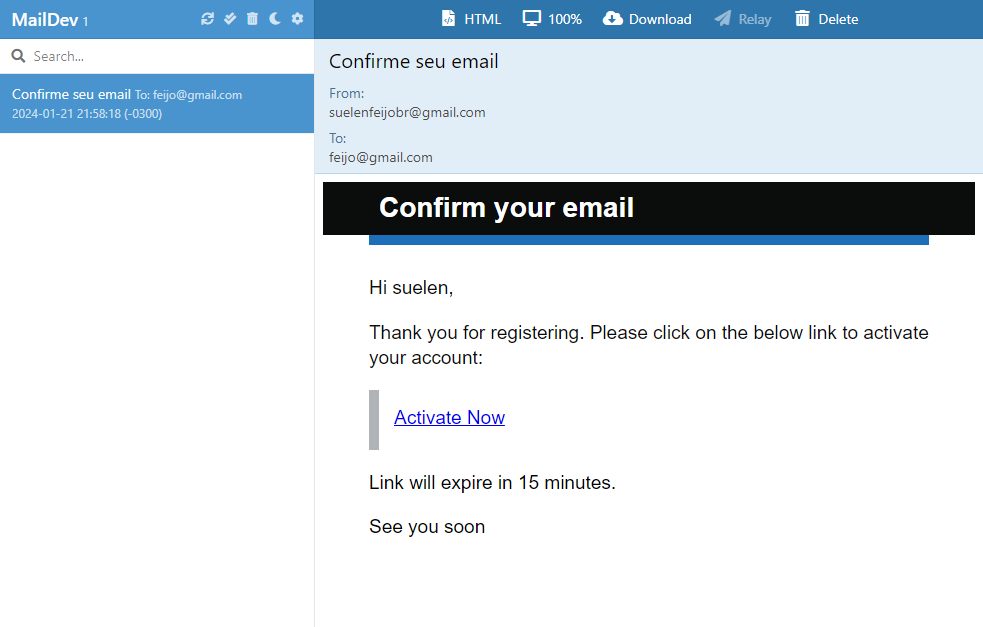
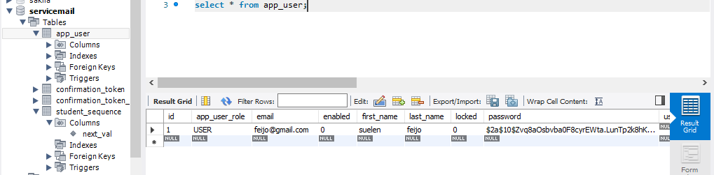

#API - LocalHost Email Sending - Mail Dev

* Spring Boot
* Spring Security
* Java Mail
* Email verification with expiry
* Spring Boot
* Maildev
* MySQL

</br>
</br>
 
### Email Dev
</img>
</br>
</br>


</br>
</br>
 
### Postman
</img>
</br>
 ```
 Link API: localhost:8080/api/v1/registration
 ```
 ```


 Postman example
{
  "firstName": "suelen",
  "lastName":"feijo",
  "email":"feijo@gmail.com",
  "password": "123"
}
```


